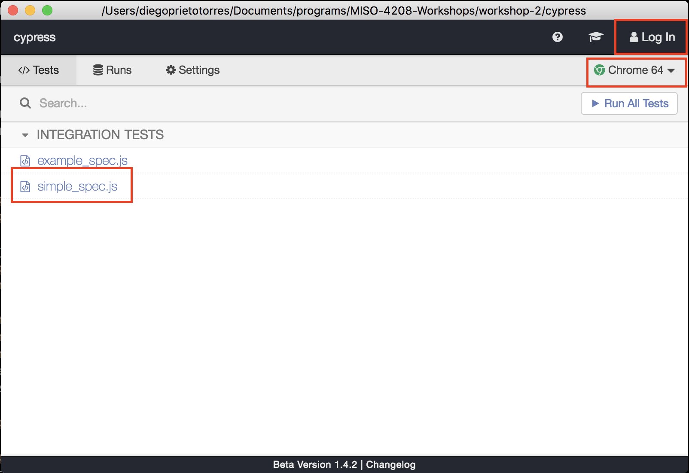
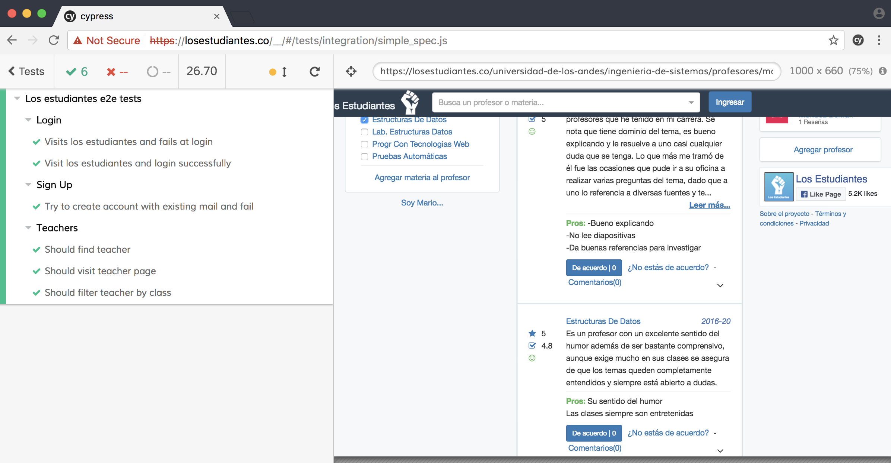
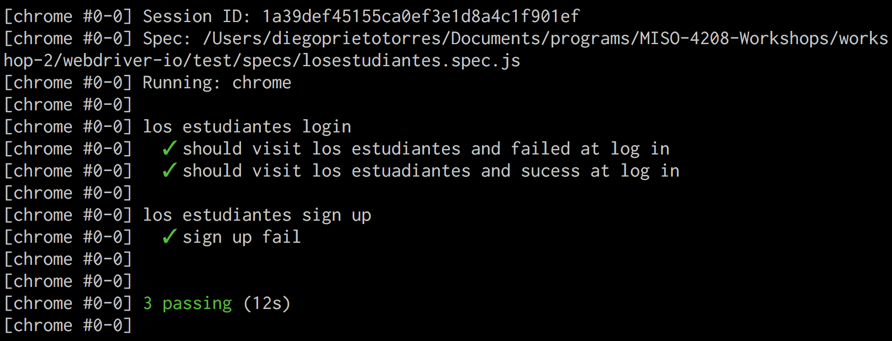

# Workshop - 2

--- 

## Cypress

**Problemas**
Cuando descargue `Cypress` para MacOS, al intentar iniciar sesión con `GitHub`, salía un error que decia. `GitHub no soporta este navegador`, intente varias acciones para solucionar el problema, pero no fue posible, por tal razón instale `Cypress` usando `yarn` a través de linea de comandos. Para ejecutarlo solo basta introducir `./node_modules/.bin/cypress open`.

**Conclusiones**

* No sirvió la instalación para MAC descargandolo desde la página oficial, decia que GitHub no soportaba ese navegador. para solucionarlo fue necesario instalarlo por medio de línea de comandos con `npm`.
* La interfaz gráfica es sin lugar a duda una de las mejores ventajas.
    * Permité visualizar ejecución en el browser y resultado de las pruebas al mismo tiempo.
    * La posibilidad de navegar a través de los diferentes screenshots que se van generando con cada prueba es una funcionalidad perfecta para hacer un debug estático.
    * El hecho de poder interactuar con las herramintas de desarrollador del browser permite parar la prueba en cualquier momento y revisar el estado completo de la aplicación para identificar posibles inconsisntencias.
* El manejo de cache del browser es un poco compicado cuando se ejecutan 2 instancias de pruebas al mismo tiempo.

---

## Protractor

**Conclusiones**

* La definición de funciones hace que la reutilización de lógica sea muy versatil y por ende la construcción sistematica de pruebas e2e.
* El hecho que trate a los elementos html como objetos permite de forma programatica organizar la información de la forma más comveniente para probar las aserciones.
* La busqueda por medio de selectores es muy comoda y practica, poder buscar un elemento de forma progresiva mientras se concatenan funciones es una gran característica.

---

## WebDriver IO

**Problemas**
* Los selectores no funcionan muy bien, de forma esporadica fallan.
* Los modales, por alguna razón no desaparecen del todo cuando lo cierran, así que los eventos de click son capturados por los modales. Para solucionarlo hice un workaround, cargar dos veces la página así el `LocalStotrage` ya tenía la llave de NO mostrar el modal.

**Conslusiones**
* No me gusto
* Desempeño dudoso.
* No es idempotente.
* Genera imagenes de error y eso es bueno.

---

## Nightwatch

**Conclusiones**

* La sintaxís encadenada es muy comoda y sencilla de usar.
* Los selectores son anidados y van buscando elementos a medida que avanza la selección, son muy útiles para evitar largas referencias.
* Chrome resulto ser una mala elección para ejecutar las pruebas.
* En firefox las pruebas se ejecutaron sin problema.

---