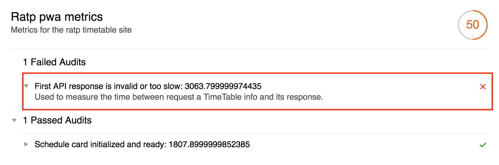

# Workshop 3

---

## Prueba en Lighthouse

Fue muy interesante saber que lighthouse permite construir sus propias métricas, acontinuación adjunto las imagenes de las nuevas métricas que fueron tomadas de la aplicación RATP tanto de forma local como sobre firebase.

Puede ver el reporte local completo en este enlace: [Reporte Local 1](http://htmlpreview.github.io/?https://raw.githubusercontent.com/daprieto1/MISO-4208-Workshops/master/workshop-3/ratp-pwa/lighthouse/reports/localhost_2018-02-15_18-05-52.report.html)

Puede ver el reporte de firebase completo en este enlace: [Reporte Firebase 1](http://htmlpreview.github.io/?https://raw.githubusercontent.com/daprieto1/MISO-4208-Workshops/master/workshop-3/ratp-pwa/lighthouse/reports/schedules-app-a85c0.firebaseapp.com_2018-02-15_18-07-54.report.html)

## Tiempo de respuesta del API

Para medir si el tiempo de respuesta de una petición hecha al API de ratp dura menos de 3 segundos, fue necesario:

* Modificar el archivo `custom-config.js` para añadir la nueva auditoria y recolección.
* Crear el nuevo recolector en el archivo `api-gatherer.js`.
* Crear la nueva metrica de auditoria en el archivo `api-audit.js`.
* Modificar el archivo `app.js` para que una vez se tuviera la primera respuesta exitosa por parte del API de ratp, guardara la métrica correspondiente.

`window.APILoadtime  = performance.now();`

Las pruebas locales corren perfectamente.

Puede ver el reporte local completo en este enlace: [Reporte Local 2](http://htmlpreview.github.io/?https://raw.githubusercontent.com/daprieto1/MISO-4208-Workshops/master/workshop-3/ratp-pwa/lighthouse/reports/localhost_2018-02-15_18-31-08.report.html)

Las pruebas en firebase fallaron inicialmente por tiempos de respuesta del API de ratp.

Puede ver el reporte de firebase completo en este enlace: [Reporte Firebase 2](http://htmlpreview.github.io/?https://raw.githubusercontent.com/daprieto1/MISO-4208-Workshops/master/workshop-3/ratp-pwa/lighthouse/reports/schedules-app-a85c0.firebaseapp.com_2018-02-15_18-32-10.report.html)

Sin embargo esta operación no es idempotente porque depende directamente del tiempo de respuesta del API que nunca es fijo, por lo tanto diferentes pruebas pueden dar diferentes resultados, para una siguiente ejecución sobre firebase, los tiempos de respuesta fueron menores a 2 segundos y todo funciono perfectamente.

Vale la pena aclarar que el API de ratp no solo no es idempotente respecto a sus tiempos de respuesta, sino que además es bastante lento, ya que durante las pruebas que se hicieron, los tiempos de respuesta nunca fueron inferiores a 2,5 segundos y la gran mayoría de veces muy cercanos a los 3 segundos.

Puede ver el reporte de firebase completo en este enlace: [Reporte Firebase 3](http://htmlpreview.github.io/?https://raw.githubusercontent.com/daprieto1/MISO-4208-Workshops/master/workshop-3/ratp-pwa/lighthouse/reports/schedules-app-a85c0.firebaseapp.com_2018-02-15_18-32-40.report.html)

