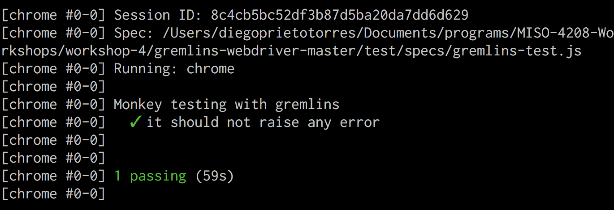

# Workshop 4

---

## Rippers ad-hoc con Cypress.io


Para generar los comandos aleatorios se reutilizo la función `getRandomInt(0, 4)` para obtener un nñumero de `0` a `3`; dicho número correspondía a un evento en particular.

```js
switch (randomEventId) {
    case 0:
      console.log('-> Link Click Event');
      event = randomLinkClickEvent(monkeysLeft);
      break;
    case 1:
      console.log('-> Type Event');
      event = randomTypeEvent(monkeysLeft);
      break;
    case 2:
      console.log('-> Select Event');
      event = randomSelectEvent(monkeysLeft);
      break;
    case 3:
      console.log('-> Button Click Event');
      event = randomButtonClickEvent(monkeysLeft);
      break;
}
```

* El evento `randomTypeEvent` se limito para escribir únicamente en campos de typo texto, debido a que cualquier otro tipo de entrada estaba generando error al momento de la interación con el elemnto.

* para el evento `randomSelectEvent` se dejo aleatoria la selección de la opción en particular, reutilizando una vez más la función `getRandomInt`.

---

## Random Testing con gremlins.js




Fue un poco difícil entender como funcionaba, pero es una herramienta muy buena para generar eventos aleatorios. La estrategia que se uso fue:

* Usar las propiedades de los elementos `HTMLElement`, `HTMLInputElement`, `HTMLTextAreaElement`. Básicamente a través del tag name de lograba saber de que tipo era el elemnto y si cierto `gremling` debia o no interactuar con el. 
* Por otro lado dependiendo del tipo del input se determino se se debía llenar o no.
* Se asigno un 60% de probabilidad al `gremling` de click para que fuera muy evidente que se ejecutaba más que los demás.
* Finalmente se uso la propiedad `hidden` para evitar que cualquier `gremling` interactuara con elementos no visibles.