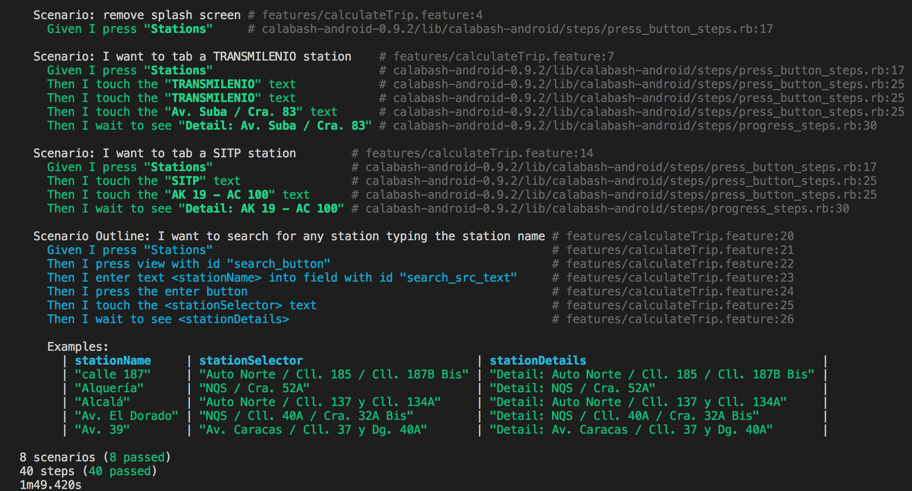
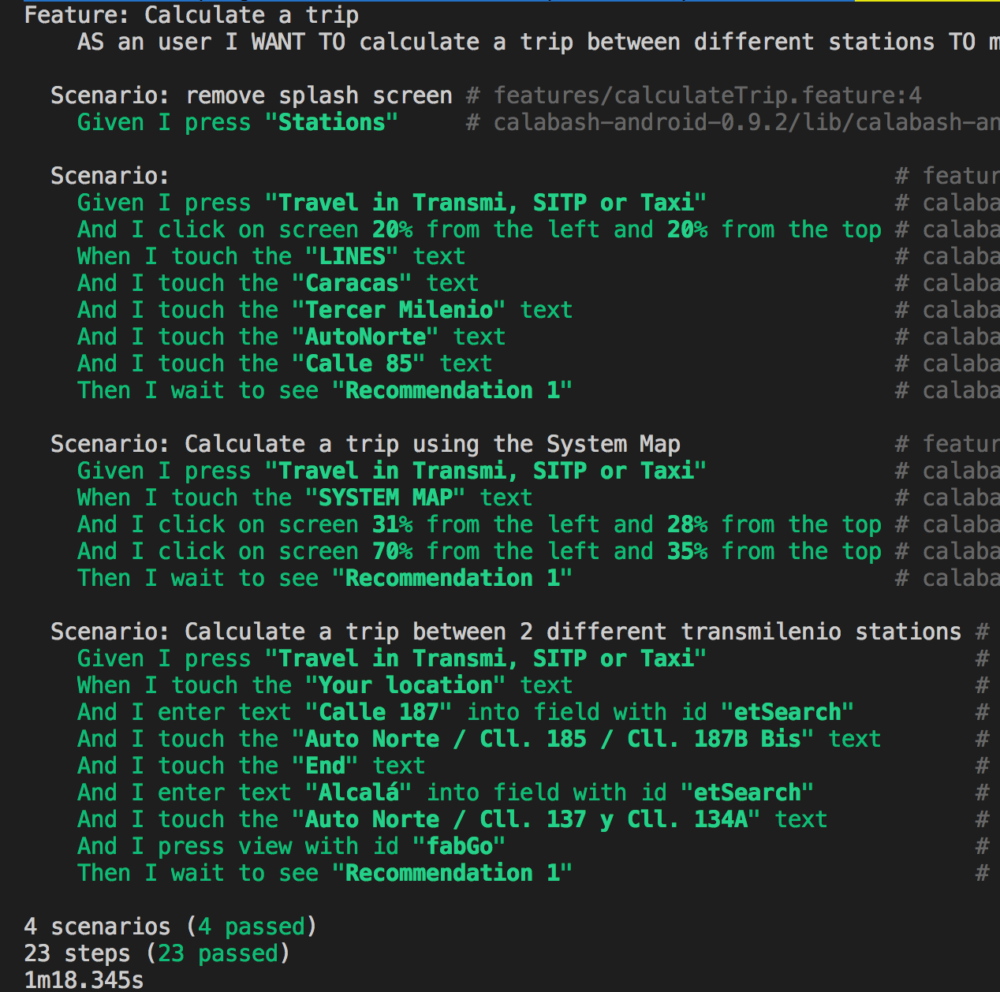

# Workshop 5

## Cucumber

Para la característica de Login se tuvieron en cuenta dos escenarios, el login exitoso y el fallido. Que debido a las tablas de datos, resultaban en `5` diferentes pruebas.

Para la carecterística de registro en los estudiantes, se tuvieron en cuenta `6` escenarios. En cada uno de los cuales se probaron diferentes tipos de errores en el formulario y su manifestación visual por medio del ícono de error, el bordeado rojo en los inputs, los mensajes de error etc.

La convinación de escenarios y datos da como resultado una ejecución de `20` pruebas con `106` steps o aserciones.

---

## Calabash

### Busqueda de estaciones

Esta es una funcionalidad muy usada, por eso muismo la escogí, la aplicación permite acceder a la información de cualquier estación en particular y las divide entre estaciones del Sistema Integrado de transporte SITP y estaciones de Transmilenio.

Los escenarios cubren la funcionalidad por completo con `3` escenarios claves; la selección de una estación en particular por medio de la navegación de cada uno de los tabs de la vista `estaciones` y la búsqueda de una estación en particular que se ejecuta multiples veces con diferentes estaciones de ejemplo.

A continuación se puede observar la ejecución de uno de los escenarios usando datos de la tabla de ejemplos:

### Calculo de rutas

La siguiente característica escogida fue el calculo de rutas por parte de la aplicación, la cual es la razón principal de la existencia de la aplicación, la funcionalidad por la cuál la mayoría de usuarios descargan el aplicativo.

La aplicación tiene básicamente 3 formas de calcular una ruta usando el transporte público, estas son:

* Escribir el nombre de las estaciones.
* Seleccionar las estaciones en el mapa.
* Seleccionar las estaciones por torncal.

Cada uno de esos tres escenarios fueron los seleccionados y probados con una tabla de ejemplos de `4` registros para cada una; lo cual deja como resultado `3` escenarios con `12` ejecuciones de pruebas automatizadas.

**Escribir el nombre de las estaciones**

**Seleccionar las estaciones en el mapa**

Esta prueba tiene un problema y debido a que es necesario hacer click sobre el mapa bajo posiciones cardinales `x` y `y` indicadas con porcentaje, lo cual produce un bajo mantenimiento de la prueba si esta es ejecutada sobre diferentes dispositivos con tamaños de pantallas diferentes.

**Seleccionar las estaciones por torncal**

