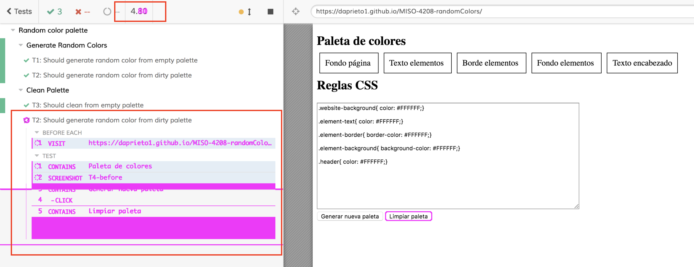
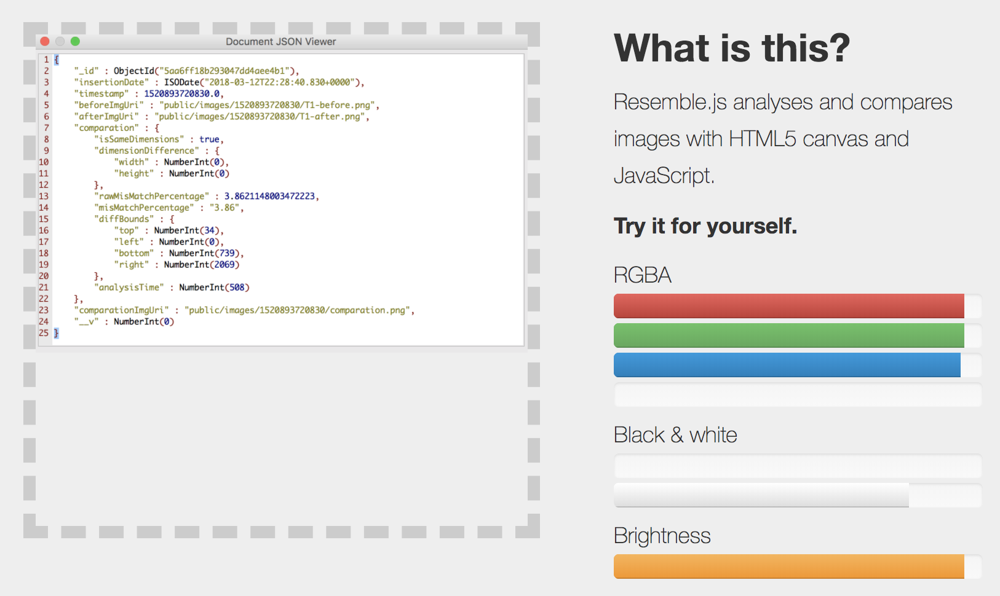
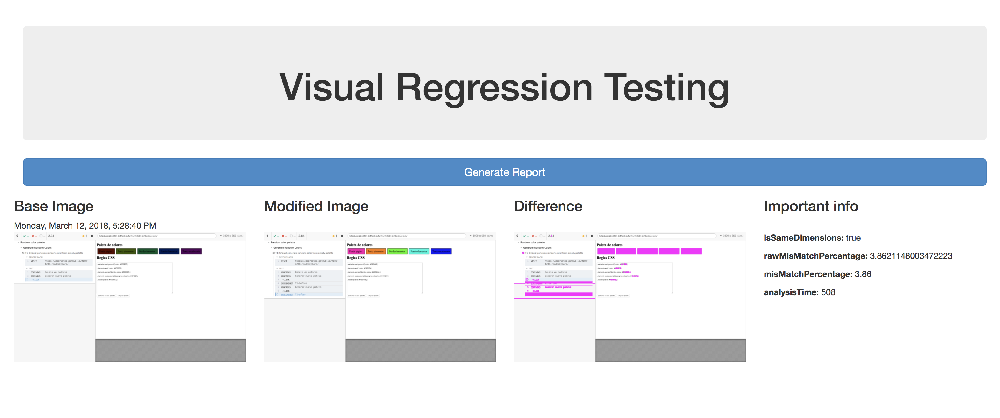
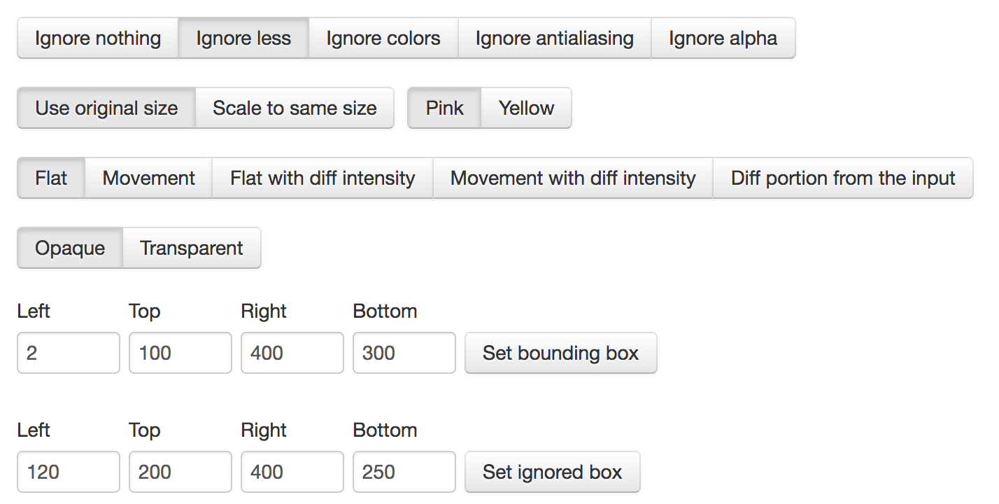
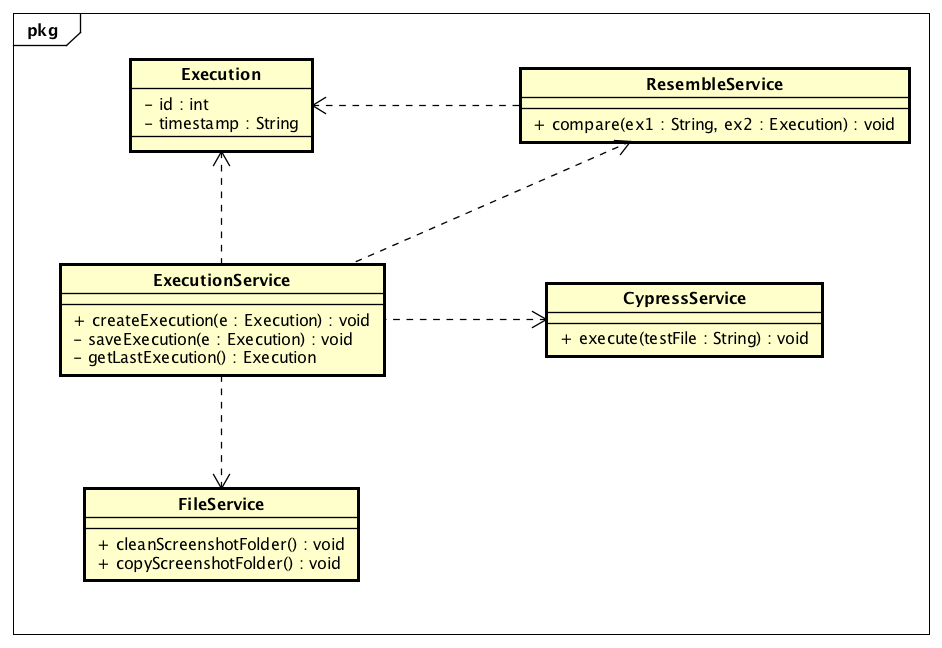
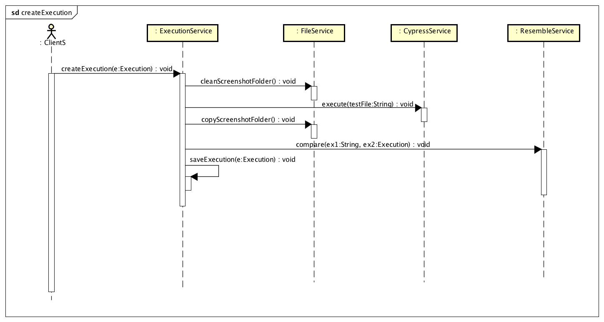
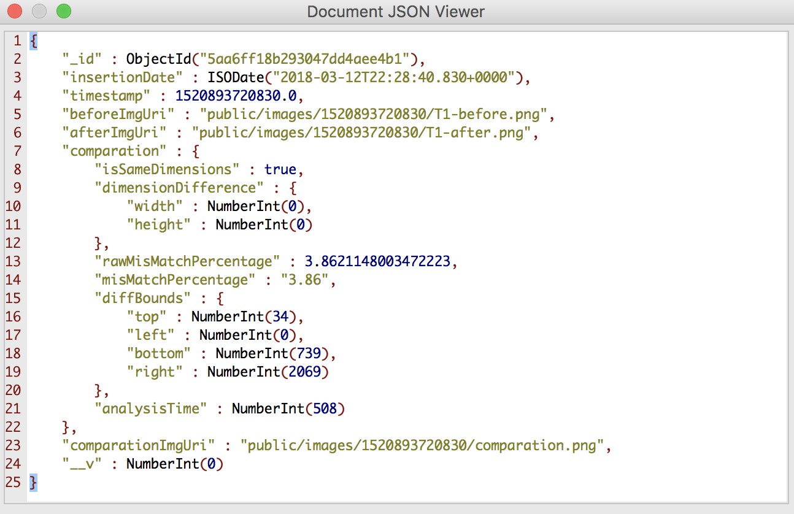

# Workshop 6 - Visual Regression Testing utilizando Resemble JS

## Aplicación paleta de colores

**Repositorio de Git:** [Github](https://github.com/daprieto1/MISO-4208-randomColors)

**Página desplegada:** [GitPages](https://daprieto1.github.io/MISO-4208-randomColors/)

## Pruebas con Cypress

**¿Ve usted algún problema con los screenshots tomados por Cypress al intentar hacer Visual Regression Testing?**

Los screenshots que genera `Cypress` cuando se ejecuta Headful y Headless incluyen no solamente el área del browser, sino que también incluyen el área de logs de Cypress, lo cual puede generar pequeñas diferencias en una prueba de regresión visual, debido a que los resultados de mñultiples pruebas no son exactamente iguales para la interfaz gráfica de cypress, como los tiempos de ejecución, la hora, los logs etc.

La siguiente imagen es el resultado de comparar dos screenshots que fueron tomados con cypress en modo Headful, tales screenshots se capturaron con una diferencia de algunos milisegundos, podemos evidenciar la gran diferencia que produce la interfaz gráfica de cypress.



## ResembleJS

**¿Qué información puedo obtener de una imagen al usar resembleJS y que significado tiene cada uno de los componentes de la respuesta?.**

Con resembleJS puedo analizar imagenes de forma independiente y obtener información de su color para cada uno de los componentes RGB, además de la cantidad de color blanco y negro presente en la imagen medido en porcentaje; finalmente un parámetro adicional me indica la cantidad de brillo de la imagen.

```json
{
    red: 100,
    green: 100,
    blue: 100,
    brightness: 100,
    alpha: 100,
    white: 100,
    black: 100
}
```



**¿Qué información puedo obtener al comparar dos imagenes?**

Al comparar dos imagenes con ResembleJS, puedo obtener información de: misma dimensión, diferencia en las dimensiones, porcentage de diferencia, porcentage de diferencia aproximado, diferencia en los limites de la imagen, tiempo que tomo hacer el analisis.

```json
{
    "isSameDimensions" : true, 
    "dimensionDifference" : {
        "width" : NumberInt(0), 
        "height" : NumberInt(0)
    }, 
    "rawMisMatchPercentage" : 3.7820095486111107, 
    "misMatchPercentage" : "3.78", 
    "diffBounds" : {
        "top" : NumberInt(33), 
        "left" : NumberInt(0), 
        "bottom" : NumberInt(697), 
        "right" : NumberInt(2069)
    }, 
    "analysisTime" : NumberInt(962)
}
```



**¿Qué opciones se pueden seleccionar al realizar la comparación?**

Las opciones se pueden organizar en 7 grupos:

* Ignorar: Nada, menos, colores, alpha etc.
* Tamaño: escalado u original.
* Color de diferencias
* Error por movimiento y localización
* Resaltado de similitudes opaco o transparente
* Caja de evaluación
* Caja para ignorar en la evaluación



## Herramienta de automatización de Visual Regression Testing

**Repositorio de Git:** [Github](https://github.com/daprieto1/MISO-4208-visualTesting)

**Página desplegada:** [Heroku](https://visualregressiontesting.herokuapp.com/)

La herramienta fue hecha usando `Node`, `AngularJs` y `Mongo`. A continuación se presentan los diagramas de la arquitectura de la solución de software.

### Diagrama de clases



### Diagrama de Secuencia



La aplicación funciona muy bien de manera local y en servidores Linux, aún no ha sido posible desplehgarla en `heroku` debido a que no ha sido posible ejecutar cypress desde heroku.

Sin embargo la base de datos si esta soportada haciendo uso de un `addon` de `heroku` para desplegar bases de datos de tipo mongo. A continuación se muestra el resultado del objeto que se guarda.



Este es un screenshot del front de la aplicación y después se adjunta un gift del funcionamiento de la misma.


